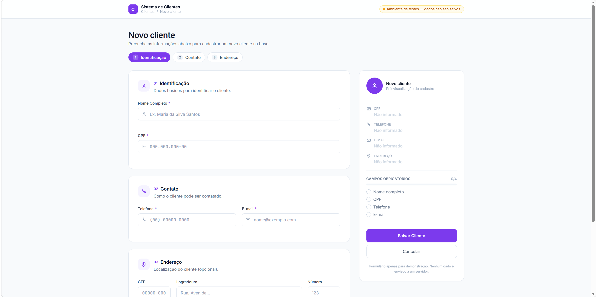
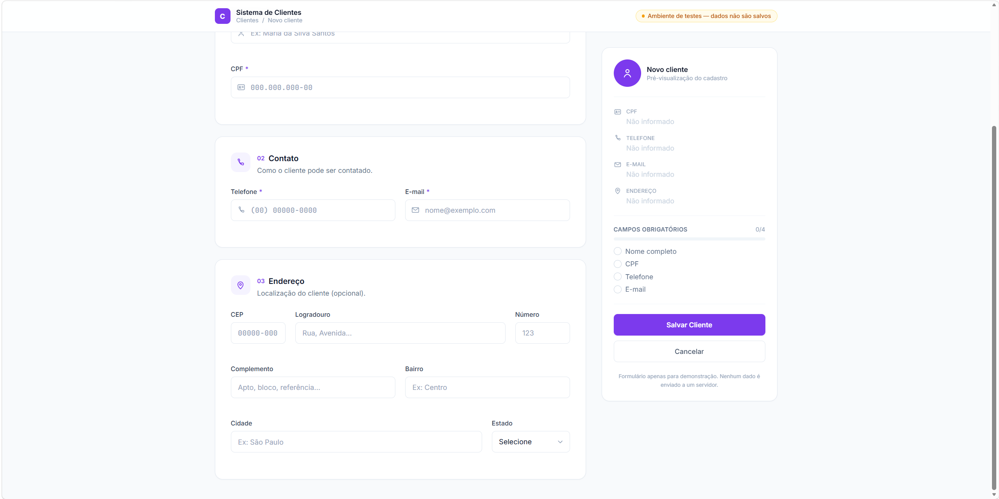

# Bônus — Tela de cadastro de clientes

Tela de front-end (sem backend, sem persistência real) gerada em uma ferramenta separada (Claude Fable 5, com skill de desenvolvedor front-end), fora do escopo do Laravel — só o front-end estático, como pedido no enunciado.

## Código-fonte

[bonus/CadastroCliente.html](bonus/CadastroCliente.html) — arquivo único, pronto para abrir direto no navegador (React + Babel Standalone + Tailwind via CDN, sem build step). É o resultado final dos dois prompts abaixo.

## Prints





## Prompts utilizados

### 1. Criação do projeto (site)

Configuração de execução: Modelo Claude Fable 5, skill "desenvolvedor front-end" ativa (arquivo anexado).

```
Desenvolva APENAS o front-end de uma tela de cadastro de clientes.
Não implemente backend, banco de dados nem persistência real — os dados
não precisam ser salvos, mas toda a validação deve funcionar no navegador.

Prioridade visual: a tela deve ser esteticamente polida e moderna, com
hierarquia clara, espaçamento generoso, tipografia legível e uma paleta
coerente. Evite aparência de template genérico.

Stack: React + Tailwind CSS, componente único, sem dependências pesadas.

Campos (marque visualmente os obrigatórios com asterisco e/ou cor):
- Nome Completo (obrigatório)
- CPF (obrigatório, com máscara 000.000.000-00)
- Telefone (obrigatório, com máscara (00) 00000-0000)
- E-mail (obrigatório)
- CEP (com máscara 00000-000)
- Logradouro
- Número
- Complemento
- Bairro
- Cidade
- Estado (dropdown com as 27 UFs)

Comportamento obrigatório:
- Validação client-side ao clicar em Salvar: nome não vazio, CPF com
  formato válido, telefone com formato válido, e-mail com formato válido.
- Mensagens de erro inline, abaixo de cada campo, em vermelho, aparecendo
  apenas após tentativa de envio ou ao sair do campo (blur).
- Botão "Salvar": valida tudo; se ok, exibe mensagem de sucesso; se não,
  destaca os campos com erro e rola até o primeiro.
- Botão "Cancelar": limpa todos os campos e remove mensagens de erro.

Layout:
- Organização em grid: campos de endereço agrupados visualmente
  (ex.: CEP/Logradouro/Número numa linha lógica).
- Responsivo: uma coluna no mobile, duas ou mais no desktop.
- Botões alinhados ao final do formulário, Salvar em destaque.

Entregue o código completo em um único arquivo, pronto para rodar.
```

### 2. Prompt de melhoria do front-end (redesign visual)

```
Você deve atuar como um Senior Front-end Engineer especializado em UI/UX Design, com experiência em criação de sistemas SaaS modernos, dashboards e aplicações corporativas.

Tenho um projeto front-end atualmente funcional, porém a interface está visualmente ruim: desalinhada, com excesso de espaços vazios, pouca hierarquia visual, aparência genérica e pouca preocupação com experiência do usuário.

O objetivo é fazer um redesign completo da camada visual, mantendo a funcionalidade existente.

Use como referência visual e de experiência:

https://doc.onvox.com.br/

Analise esse site como inspiração para:

organização das informações;
hierarquia visual;
espaçamento;
agrupamento de conteúdos;
experiência de navegação;
aparência profissional de software SaaS;
clareza dos formulários;
consistência visual.

Não copie o layout, utilize apenas como referência de qualidade e padrão visual.

Seu papel

Antes de alterar qualquer código:

Analise a interface atual.
Identifique problemas de:
espaçamento;
alinhamento;
proporção dos elementos;
excesso de áreas vazias;
falta de hierarquia;
problemas de UX;
componentes mal organizados.
Proponha uma estratégia de melhoria.
Depois implemente o redesign.
Prioridade principal

A prioridade é:

1. UX/UI Design
2. Organização visual
3. Experiência do usuário
4. Código limpo

Não quero apenas "deixar bonito". Quero uma interface com aparência de produto profissional.

Diretrizes de Design

Transforme a aplicação em algo próximo de um sistema SaaS moderno.

Características esperadas:

Layout limpo e profissional;
Melhor aproveitamento do espaço;
Menos áreas vazias sem propósito;
Conteúdo agrupado em blocos visuais;
Melhor equilíbrio entre textos, inputs e ações;
Hierarquia clara entre títulos, subtítulos e informações;
Componentes visualmente consistentes;
Boa leitura em telas grandes;
Excelente experiência no mobile.
Formulários

Os formulários atualmente parecem simples demais e pouco organizados.

Melhore:

agrupamento dos campos;
ordem das informações;
espaçamento entre seções;
labels;
placeholders;
mensagens de validação;
estados de erro;
estados de foco;
estados preenchidos.

Utilize conceitos de:

formulário em etapas quando fizer sentido;
cards/seções;
divisores visuais;
campos relacionados próximos.

Evite uma grande lista vertical de inputs sem organização.

Campos e componentes

Crie componentes visuais modernos:

Inputs:

altura consistente;
bordas suaves;
foco destacado;
transições;
ícones quando fizer sentido;
melhor contraste;
feedback visual.

Botões:

ação principal destacada;
ação secundária discreta;
estados hover;
estados loading se necessário.

Cards:

sombras leves;
bordas sutis;
espaçamento interno adequado.
Paleta visual

Crie uma identidade visual coerente.

Evitar:

cores muito fortes sem propósito;
excesso de roxo/neon;
aparência de template automático.

Priorizar:

fundo elegante;
contraste adequado;
cores profissionais;
destaque visual apenas onde necessário.
Responsividade

O design deve funcionar perfeitamente em:

desktop;
notebook;
tablet;
celular.

Não pode existir:

scroll horizontal;
elementos quebrados;
campos espremidos.
Experiência do usuário (UX)

Adicionar melhorias como:

feedback claro das ações;
mensagens de sucesso e erro melhores;
navegação intuitiva;
redução da carga visual;
informações importantes mais evidentes.

O usuário deve entender rapidamente:

onde está;
o que precisa preencher;
qual ação executar.
Regras técnicas
Não alterar regras de negócio.
Não criar backend.
Não modificar integrações existentes.
Não remover funcionalidades.
Manter compatibilidade com a arquitetura atual.
Priorizar componentes reutilizáveis.
Evitar código duplicado.
Resultado esperado

Ao finalizar, quero uma aplicação com aparência de:

produto SaaS premium;
sistema corporativo moderno;
interface desenvolvida por um time profissional de produto.

A sensação final deve ser:

"Esse sistema parece uma ferramenta comercial pronta para clientes."

Não entregue apenas sugestões. Faça as alterações necessárias no front-end.

Antes de codificar, apresente uma breve análise dos problemas encontrados e o plano de redesign.
```

## O que eu mudaria antes de produção

- **Validação de CPF real**: a tela hoje valida só o *formato* (máscara `000.000.000-00`), não o dígito verificador. Antes de produção, precisa validar o CPF de verdade (algoritmo dos dígitos verificadores), tanto no front quanto — principalmente — no backend, já que validação client-side nunca é suficiente sozinha.
- **Não confiar só na validação client-side**: toda validação feita hoje (nome, CPF, telefone, e-mail) roda no navegador e pode ser burlada facilmente (DevTools, requisição direta à API). Ao integrar com um backend real, cada campo precisa ser revalidado no servidor (aqui, isso seria um Form Request no Laravel, no mesmo espírito do `BuscarEnderecoRequest` da Parte 3).
- **Máscaras**: confirmar que as máscaras (CPF, telefone, CEP) tratam colar texto (paste) e edição no meio do campo, não só digitação sequencial — é um ponto comum de quebra em implementações de máscara client-side.
- **Acessibilidade**: revisar contraste de cores, `aria-label`/`aria-describedby` nas mensagens de erro inline (para leitores de tela associarem o erro ao campo), navegação por teclado entre as 3 etapas (Identificação/Contato/Endereço), e foco visível em todos os elementos interativos.
- **Integração real com backend**: hoje o botão "Salvar" só exibe uma mensagem de sucesso local (aviso "Ambiente de testes — dados não são salvos"). Em produção, precisaria chamar um endpoint real (ex.: `POST /api/clientes`), tratar erros de rede/validação do servidor, e mostrar estado de carregamento no botão durante a chamada.
- **CEP não busca endereço automaticamente**: a tela tem o campo CEP, mas não vi integração para autopreencher Logradouro/Bairro/Cidade/Estado ao digitar o CEP — a Parte 3 deste projeto já tem exatamente essa integração pronta (`POST /api/enderecos`), então uma integração real aproveitaria esse endpoint em vez de deixar o usuário preencher tudo manualmente.
